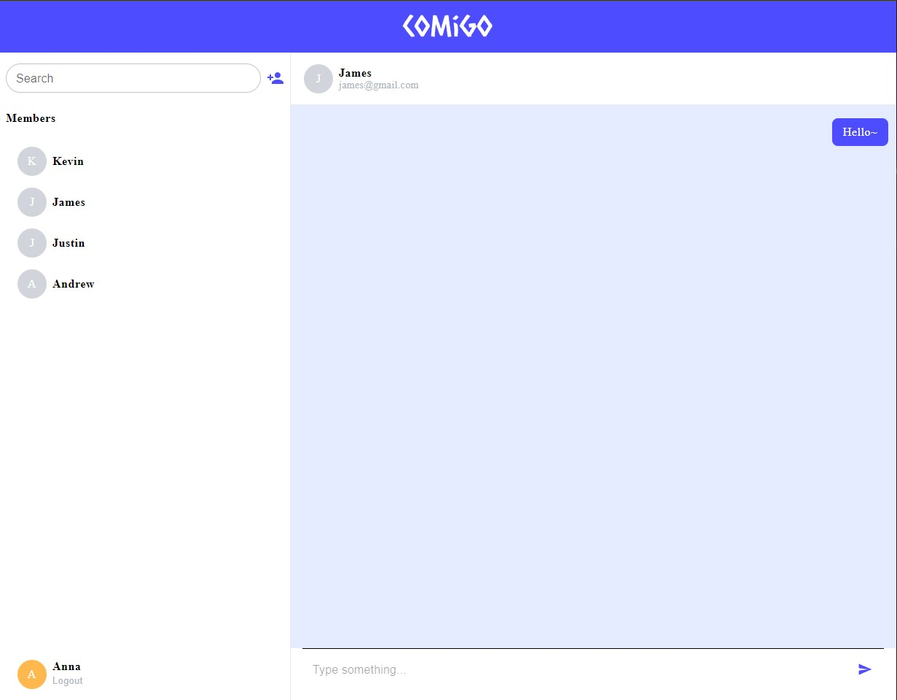
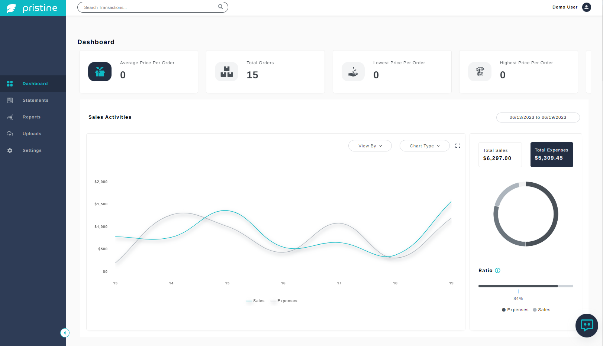

## Hi there 👋, my name is Caitlyn

I am a Full Stack Developer with a passion for creating innovative and user-friendly web applications. My skills include proficiency in various programming languages such as JavaScript and HTML/CSS, as well as experience with popular frameworks such as React and Node.js. I am always eager to learn new technologies and stay up-to-date with industry trends. I am a problem-solver at heart and strive to create elegant solutions for complex challenges.

## Languages and Tools

.svg?style=for-the-badge&logo=cypress&logoColor=white>)

## My Projects

### Comigo | Chat App

🔸 [GitHub](https://github.com/caitlynng/comigo-chat-app) | [Live Demo](https://comigo.vercel.app/)

### Pristine | Business Expense Management App

🔸 [GitHub](https://github.com/caitlynng/pristine-demo) | [Live Demo](https://pristinedept.com/)

## Contact Me

